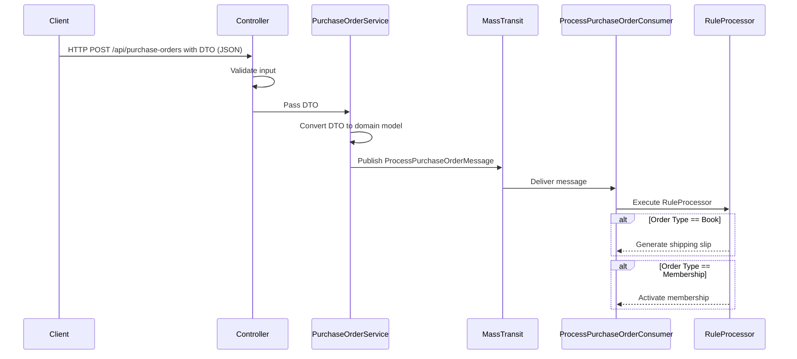

# SB-FunBooksAndVideos: Purchase Order Processor

## Overview
The **FunBooksAndVideos Purchase Order Processor** is a microservice designed to handle purchase orders for an online store. It processes orders, applies business rules, and integrates with external services for membership activation and shipping slip generation. The service is built using ASP.NET Core and follows a clean architecture pattern.

## Key Features
- **RESTful API**: The service exposes a RESTful API for processing purchase orders.
- **Business Rules**: Implements a flexible rule engine that applies various business rules to purchase orders.
- **Asynchronous Processing**: Utilizes MassTransit for asynchronous message processing, allowing for scalability and decoupling of services.
- **Swagger Documentation**: Automatically generates API documentation using Swagger, providing example requests and responses.

## Architecture
The solution is structured into several projects, each serving a specific purpose. Below is a breakdown of the main components:

### 1. **Api**
- **Controllers**: Contains the API controllers that handle incoming HTTP requests. The `PurchaseOrdersController` processes purchase orders and interacts with the service layer.
- **Filters**: Contains filters for Swagger documentation, providing example data for API endpoints.
- **GlobalExceptionHandlerMiddleware**: Middleware for handling exceptions globally and returning appropriate error responses.

### 2. **Application**
- **Interfaces**: Defines contracts for services and processors, including membership and shipping slip services.
- **Models**: Contains data transfer objects (DTOs) such as `PurchaseOrderDto` for transferring data between layers.
- **Processors**: Implements the business logic for processing purchase orders and applying rules.
- **Rules**: Contains business rules that determine how orders are processed, such as membership activation and shipping slip generation.
- **Services**: Implements the service layer for handling purchase orders.

### 3. **Domain**
- **Entities**: Contains domain entities like `PurchaseOrder` and `PurchaseOrderLine` that represent the core business objects.
- **Events**: Defines events related to order processing, such as `ProcessPurchaseOrderMessage`.

### 4. **Infrastructure**
- **Messaging**: Contains consumers that handle messages from a message broker (MassTransit) for processing orders asynchronously.
- **Services**: Implements external services for activating memberships and generating shipping slips.

### 6. **SharedContracts**
- Contains shared models and enums used across the application, such as `Membership` and `ProductType`.

## Data Flow
- Client submits a purchase order to the API endpoint
- PurchaseOrderService validates and converts the DTO to a domain model
- A ProcessPurchaseOrderMessage is published to MassTransit
- ProcessPurchaseOrderConsumer processes the message
- RuleProcessor evaluates and applies applicable business rules

## Business Rules Implemented
The system is designed with a rule-based architecture to allow for flexible business logic:

- **Membership Activation Rule:** When a membership product is purchased, the system activates the membership for the customer
- **Shipping Slip Rule:** When physical products (books) are purchased, the system generates a shipping slip

## Technology Stack
- .NET 8.0
- MassTransit: Message bus for asynchronous communication
- Swagger/OpenAPI: API documentation and testing
- Dependency Injection: For service composition and testability

## Request Overview

## Extension Points
The rule-based architecture allows for easy addition of new business rules without modifying existing code:

- Implement the IRule interface
- Register the new rule in the DI container
- The rule will be automatically applied when applicable
